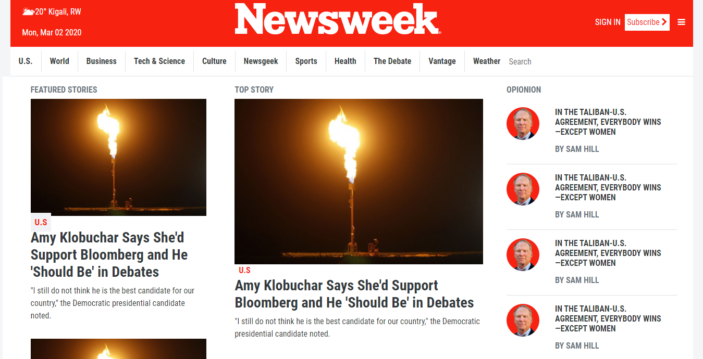

# Responsive-Newsweek

This project requests students to build a replica of the news site Newsweek.com using the Bootstrap framework

## Built With

- HTML5 and
- CSS3
- Bootstrap

## Live Demo

[Live Demo Link](-)

## Author

👤 **Maurice Murangwa**

- Github: [@Morrism1](https://github.com/Morrism1)
- Twitter: [@MorrisMontana0](https://twitter.com/MorrisMontana0)
- Linkedin: [Maurice Murangwa](https://www.linkedin.com/in/murangwa-maurice-769549140/)

## 🤝 Contributing

Contributions, issues and feature requests are welcome!

Feel free to check the [issues page](issues/).

## Show your support

Give a ⭐️ if you like this project!

## 📝 License

This project is [MIT](lic.url) licensed.
